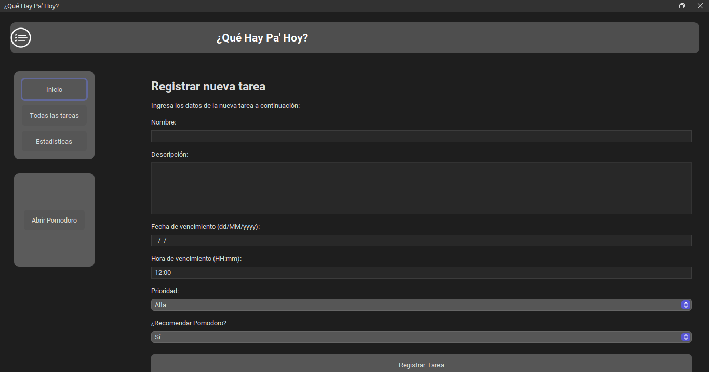
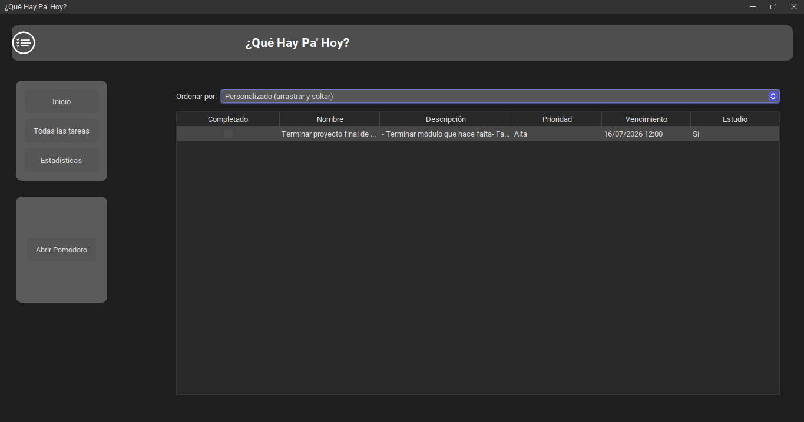
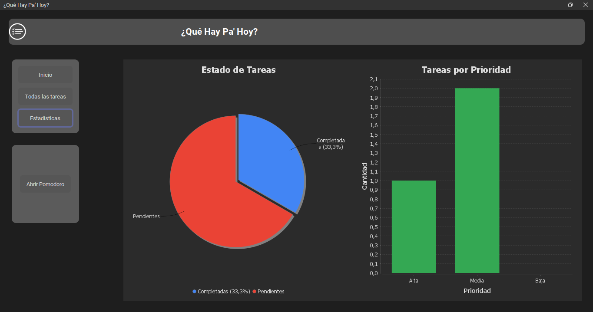
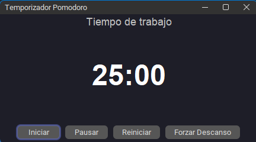

# QueHayPaHoy

Aplicación de escritorio desarrollada en Java para la gestión de tareas personales, diseñada para ayudar al usuario a organizar sus actividades y visualizar su progreso.

## Contexto

Proyecto desarrollado como trabajo final para la asignatura Programación I.

## Capturas

### Registrar tarea

### Ver y ordenar tareas

### Estadísticas

### Temporizador Pomodoro

## Arquitectura
- Modelo-Vista-Controlador (MVC)

## Tecnologías
- Java
- Swing
- Maven
- MigLayout
- FlatLaf
- JFreeChart
- Git

## Funcionalidades
- Registrar, editar y eliminar tareas.
- Marcar tareas como completadas.
- Visualizar y ordenar la lista de tareas.
- Consultar estadísticas de tareas completadas y pendientes mediante gráficas.
- Utilizar un temporizador Pomodoro para mejorar la productividad.

## Cómo ejecutar

1. Clonar el repositorio.
2. Abrir el proyecto con un IDE compatible con Maven.
3. Ejecutar la clase principal.

## Aprendizajes
Durante el desarrollo de este proyecto aprendí a:

- Aplicar el patrón de arquitectura MVC.
- Desarrollar interfaces gráficas con Swing.
- Diseñar interfaces modernas utilizando MigLayout y FlatLaf.
- Gestionar dependencias y la estructura del proyecto con Maven.
- Generar gráficas con JFreeChart.
- Organizar un proyecto siguiendo principios de programación orientada a objetos.
- Utilizar Git para el control de versiones.
- Empaquetar la aplicación como un ejecutable para Windows.

## Próximas mejoras

- Agregar persistencia de datos mediante una base de datos.
- Implementar categorías y etiquetas para las tareas.
- Incorporar notificaciones y recordatorios.
